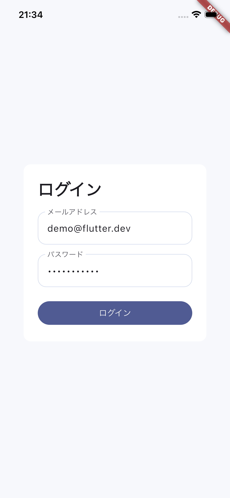
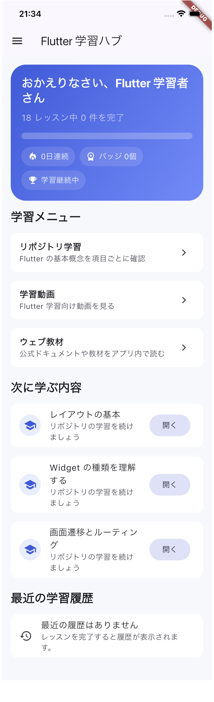
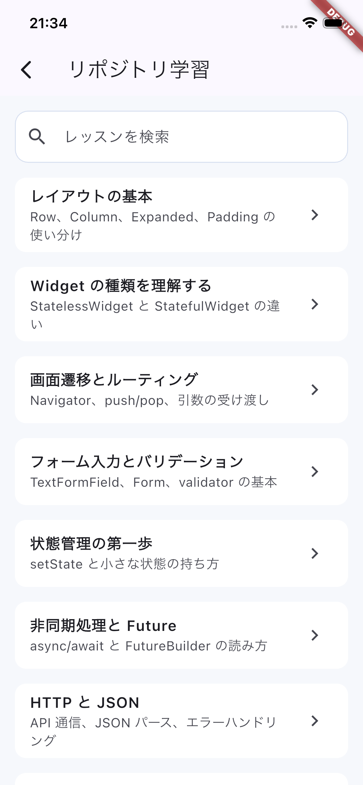

# flutter_journey

`flutter_journey` は、Flutter を学ぶための学習ハブアプリです。  
リポジトリ内の解説コンテンツ、学習動画、ウェブ教材を 1 つのアプリにまとめ、学習の進捗やバッジを管理できるようにしています。

## このプロジェクトについて

このアプリは、Flutter 初学者が複数の学習方法を行き来しながら継続して学べるように作られています。

- リポジトリ学習: Flutter の基本概念をテキストとコード例で確認
- 動画学習: YouTube 動画をアプリ内で再生
- ウェブ学習: 外部教材やドキュメントをアプリ内 WebView で閲覧
- 進捗管理: 学習完了状態、連続学習日数、最近の学習履歴を表示
- バッジ機能: レッスン完了や全体達成に応じてバッジを付与

## スクリーンショット

マネージャーやレビュー担当者にアプリの内容を短時間で伝えるために、主要画面のキャプチャを README に掲載するのがおすすめです。画像は `docs/images/` に保存すると、アプリ本体のアセットと分けて管理できます。

### ログインページ



### ホームページ



### リポジトリ学習ページ



### 学習詳細ページ


### 動画ページ


### バッジ一覧ページ


## 起動方法

### 前提

- Flutter SDK がインストールされていること
- Dart SDK が Flutter に含まれていること
- iOS Simulator / Android Emulator / Chrome などの実行環境があること

### セットアップ

```bash
flutter pub get
```

### アプリを起動

```bash
flutter run
```

利用可能なデバイスを確認したい場合:

```bash
flutter devices
```

特定のデバイスを指定して起動したい場合:

```bash
flutter run -d chrome
```

### ログイン方法

このアプリはモック認証を使っています。ログイン画面では以下のデモアカウントを利用できます。

- メールアドレス: `demo@flutter.dev`
- パスワード: `password123`

## このプロジェクトで使っている技術・学べるスキル

### 使用技術

- Flutter
- Dart
- Provider
- GoRouter
- Hive
- youtube_player_flutter
- webview_flutter

### 学べるスキル

- Flutter の画面構築と Material UI
- ルーティングと画面遷移
- 状態管理
- ローカル保存による学習進捗の永続化
- フォーム入力とログインフロー実装
- WebView と YouTube プレイヤーの組み込み
- 検索付き一覧画面の実装
- バッジや進捗表示などの学習体験設計

## 画面一覧

### 1. ログインページ

- デモアカウントでログイン
- 入力バリデーションとエラー表示あり

### 2. ホームページ

- 学習進捗のサマリーを表示
- 次に学ぶ内容、最近の学習履歴を表示
- 学習カテゴリへの導線を提供

### 3. リポジトリ学習ページ

- 学習項目を一覧表示
- キーワード検索に対応
- 学習済み項目はバッジアイコンで表示

### 4. 学習詳細ページ

- レッスン概要
- 要点まとめ
- コード例
- 学習チェック項目
- 学習完了ボタン

### 5. 学習動画ページ

- Flutter 学習用動画を一覧表示
- 検索機能あり
- 動画ごとの学習完了管理に対応

### 6. 動画再生ページ

- YouTube 動画をアプリ内で再生
- 学習完了として記録可能

### 7. ウェブ教材ページ

- 外部学習リンクを一覧表示
- 検索機能あり
- 教材ごとの進捗管理に対応

### 8. WebView ページ

- 外部教材をアプリ内で表示
- 読み込み進捗バーと再読み込み機能あり
- 学習完了として記録可能

### 9. バッジ一覧ページ

- 獲得済みバッジを一覧表示
- 学習達成状況を確認可能
